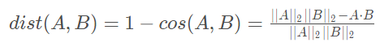
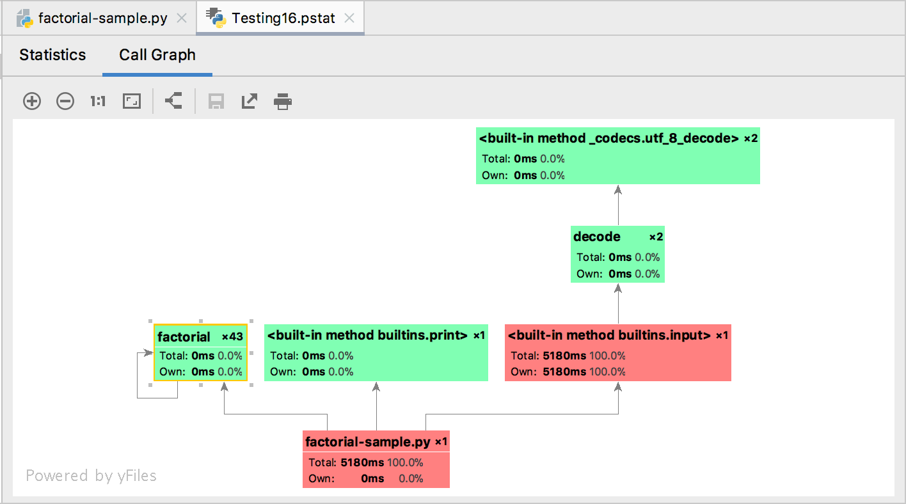

# Code-Performance-Optimization

实验平台：

* 环境：Ubuntu 16.04 LTS

* 环境：Windows10 1511、Clion、Cmake 3.17.3

目录

- [余弦距离优化](#余弦距离优化)
- [C++线程池](#C++线程池)
- [Python性能优化](#Python性能优化)
- [CUDA](#CUDA)

## 余弦距离优化

### 背景

余弦距离为用1减去余弦相似度，余弦相似度是计算两个向量间的夹角的余弦值。余弦距离更多的是从方向上区分差异，而对绝对的数值不敏感。

从上图可以看出，欧氏距离衡量的是空间各点的绝对距离，跟各个点所在的位置坐标直接相关；而余弦距离衡量的是空间向量的夹角，**更加体现在方向上的差异**，而不是位置。余弦距离在目标跟踪中的特征匹配，人脸识别中魔改损失函数都有被采用。

### 优化方案

#### 1.编译优化

g++ -[O0, O1, O2 , O3, Ofast, -ffast-math] 四级优化选项

- O1优化会消耗少多的编译时间，它主要对代码的分支，常量以及表达式等进行优化。 
- O2会尝试更多的寄存器级的优化以及指令级的优化，它会在编译期间占用更多的内存和编译时间。 
- O3在O2的基础上进行更多的优化，例如使用伪寄存器网络，普通函数的内联，以及针对循环的更多优化。 
- Os主要是**对代码大小的优化**，我们基本不用做更多的关心。 通常各种优化都会打乱程序的结构，让调试工作变得无从着手。并且会打乱执行顺序，依赖内存操作顺序的程序需要做相关处理才能确保程序的正确性。 
- Ofast, -ffast-math会降低计算的精度
- O4优化选项是将你的代码邮件给Jeff Dean重写一下:smile:

#### 2.数据类型优化

数据占用越少的空间，计算速度就越快，但是也会造成计算精度的损失

|        数据        |    位    |
| :----------------: | :------: |
| unsigned short int | 2 个字节 |
|        int         | 4 个字节 |
|       float        | 4 个字节 |
|       double       | 8 个字节 |

#### 3.多线程优化

多线程本质上是为了充分利用CPU资源。本项目采用OpenMP，OpenMP是一种针对共享内存的多线程编程技术，使用简单，只需要在需要做并行的地方加上编译指导语句，并在编译命令中加上-fopenmp选项即可。

#### 4.指令级优化

指令级优化本质上利用SIMD(单指令多数据)架构来进行计算加速，主要采用ARM Neon，Intel的指令集。

#### 5.高性能数学运算库

* OpenBLAS

  开源的矩阵计算库，包含了诸多的精度和形式的矩阵计算算法。

* MKL

  Intel数学核心函数库。

#### 6.其他

* 对所需计算向量进行利用机器学习方法进行降维（PCA）
* 向量化数据，并进行合理的字节对齐，避免非连续内存读写
* 合理设置Linux虚拟内存
* 设备的使用功率也需要在考虑的范围内
* 采用计算加速OpenCL、Vulkan、CUDA、OpenVX、OpenACC、OpenMP、OpenVINO、GEMM、Halide
* 编译优化LLVM, Glow, MLIR, TVM, XLA
* 将乘法运算变为加法运算
* 将卷积运算转为矩阵相乘（im2col，以空间换时间的方法，消耗了更多的内存）
* 对象复用、零拷贝
* 乘法和加法融合为一个三元操作 **乘加**（需要硬件支持**乘加器**）
* 循环展开和向量化（使用SIMD）
* [积分图加速矩阵块求和](https://cnbluegeek.github.io/2020/04/21/BG92-leetcode-q1314/)

### 测试数据

| 步骤                       | 耗时(us) | 加速倍数 |  总加速比   |
| :------------------------- | :------: | :------: | :---------: |
| Step 1(基准线)             | 3855587  |   x1.0   |    x1.0     |
| Step 2(-O3)                |  793150  |  x4.86   |    x4.86    |
| Step 3(-Ofast -ffast-math) |  433704  |  x1.82   |    x8.90    |
| Step 4(double->float)      |  201012  |  x2.16   |   x19.18    |
| Step 5(OpenMP)             |  123842  |  x1.62   |   x31.13    |
| Step 6(浮点转定点)         |  31298   |  ~x2.02  | **x123.19** |

## C++线程池

线程池是一种多线程处理形式，处理过程中将任务添加到队列，然后在创建线程后自动启动这些任务。线程池线程都是后台线程。每个线程都使用默认的堆栈大小，以默认的优先级运行，并处于多线程单元中。

## Python性能优化

### 性能分析工具

- timeit

- memory_profiler

- profile、cProfile：可利用[PyCharm Profile工具](https://www.jetbrains.com/help/pycharm/profiler.html#review-snapshots)进行Python性能分析，Pycharm会生成Call Graph（调用关系图）

  

### 编译优化

- **-O**：将源码编译为 pyo 而不是 pyc, pyo 文件比 pyc 小, 效果同设置环境变量 `PYTHONOPTIMIZE=1` 一样。加上该选项可以让程序的加载速度更快, 同时节省内存。理论上加载速度快些, 注意是加载速度而不是执行速度。
- **-OO** ：在 -O 基础上再删除 assert 语句和 docstring, 注意一些模块可能依赖这些语句, 所以要谨慎使用该选项

### 第三方包优化

* Numba：A High Performance Python Compiler

  在运行时将Python代码使用**LLVM编译器**编译为本地机器指令，由此来加速计算。Numba主要针对各种很大的循环优化加速。Numba对于大循环大概会有20~200倍的速度提升。
  
* PyPy

  PyPy使用了**Just-in-Time(JIT)即时编译器**，即动态编译器，与静态编译器（如gcc,java等）不同，它是利用程序运行的过程的数据进行优化。执行的时候，标准python用`python xxx.py`来执行，而pypy用`pypy xxx.py`。Pypy大概会有3~5倍的速度提升。

* Cython: 将Python 代码转成 C

* ShedSkin: 将Python 代码转成 C++

* GPULib: 使用 GPUs 加速代码

## 参考

* [**并行编程**方法优化与实践](https://book.douban.com/subject/26600702/)

  本书介绍了并行编程的方法和优化实践，主要结合X86SSE与AVX、ARMNeon、OpenMP、CUDA和OpenCL等讲解了并行编程的技术、方法和实践。

* [**并行算法**设计与性能优化](https://book.douban.com/subject/26413096/)

  主要介绍并行计算相关的算法的设计和并行计算的性能优化技巧
  
* [ThreadPool: A simple C++11 Thread Pool implementation](https://github.com/progschj/ThreadPool)

* [Intel Guide for Developing Multithreaded Applications](https://software.intel.com/content/www/us/en/develop/articles/intel-guide-for-developing-multithreaded-applications.html)

