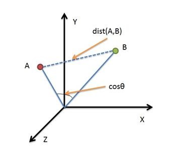

# Code-Performance-Optimization

实验平台：

* 操作系统：Ubuntu 16.04 LTS

* 操作系统：Windows10 1511

  Cmake 3.17.3

## Cosine Distance

### 背景

余弦相似度，就是计算两个向量间的夹角的余弦值，余弦距离就是用1减去这个获得的余弦相似度。余弦距离更多的是从方向上区分差异，而对绝对的数值不敏感。

从上图可以看出，欧氏距离衡量的是空间各点的绝对距离，跟各个点所在的位置坐标直接相关；而余弦距离衡量的是空间向量的夹角，**更加体现在方向上的差异**，而不是位置。余弦距离在目标跟踪中的特征匹配，人脸识别中魔改损失函数都有被采用。

#### 1.编译优化

g++ -[O0, O1, O2 , O3, Ofast, -ffast-math] 四级优化选项

- O1优化会消耗少多的编译时间，它主要对代码的分支，常量以及表达式等进行优化。 
- O2会尝试更多的寄存器级的优化以及指令级的优化，它会在编译期间占用更多的内存和编译时间。 
- O3在O2的基础上进行更多的优化，例如使用伪寄存器网络，普通函数的内联，以及针对循环的更多优化。 
- Os主要是**对代码大小的优化**，我们基本不用做更多的关心。 通常各种优化都会打乱程序的结构，让调试工作变得无从着手。并且会打乱执行顺序，依赖内存操作顺序的程序需要做相关处理才能确保程序的正确性。 
- Ofast, -ffast-math会降低计算的精度

#### 2.数据类型优化

数据占用越少的空间，计算速度就越快，但是也会造成计算精度的损失

|        数据        |    位    |
| :----------------: | :------: |
| unsigned short int | 2 个字节 |
|        int         | 4 个字节 |
|       float        | 4 个字节 |
|       double       | 8 个字节 |

#### 3.多线程优化

OpenMP是一种针对共享内存的多线程编程技术，使用简单，只需要在需要做并行的地方加上编译指导语句，并在编译命令中加上-fopenmp选项即可。

#### 4.指令级优化

指令级优化本质上利用SIMD(单指令多数据)架构来进行计算加速，主要采用ARM Neon，Intel的指令集。

#### 5.高性能数学运算库

* OpenBLAS

  开源的矩阵计算库，包含了诸多的精度和形式的矩阵计算算法。

* MKL

  Intel数学核心函数库。

#### 6.其他

* 对所需计算向量进行利用机器学习方法进行降维（PCA）
* 向量化数据，并进行合理的字节对齐
* 合理设置Linux虚拟内存
* 设备的使用功率也需要在考虑的范围内
* 采用开源图形计算加速库OpenCL、Vulkan、CUDA

### 测试数据

| 优化步骤                   | 时间(us) | 加速倍数(与上一步相比) | 总加速比(和基准线比) |
| :------------------------- | :------: | :--------------------: | :------------------: |
| Step 1(基准线)             | 3855587  |          x1.0          |         x1.0         |
| Step 2(-O3)                |  793150  |         x4.86          |        x4.86         |
| Step 3(-Ofast -ffast-math) |  433704  |         x1.82          |        x8.90         |
| Step 4(double->float)      |  201012  |         x2.16          |        x19.18        |
| Step 5(OpenMP)             |  123842  |         x1.62          |        x31.13        |
| Step 6(浮点转定点)         |  31298   |         ~x2.02         |     **x123.19**      |

## 参考

* [**并行编程**方法优化与实践](https://book.douban.com/subject/26600702/)

  本书介绍了并行编程的方法和优化实践，主要结合X86SSE与AVX、ARMNeon、OpenMP、CUDA和OpenCL等讲解了并行编程的技术、方法和实践。

* [**并行算法**设计与性能优化](https://book.douban.com/subject/26413096/)

  主要介绍并行计算相关的算法的设计和并行计算的性能优化技巧